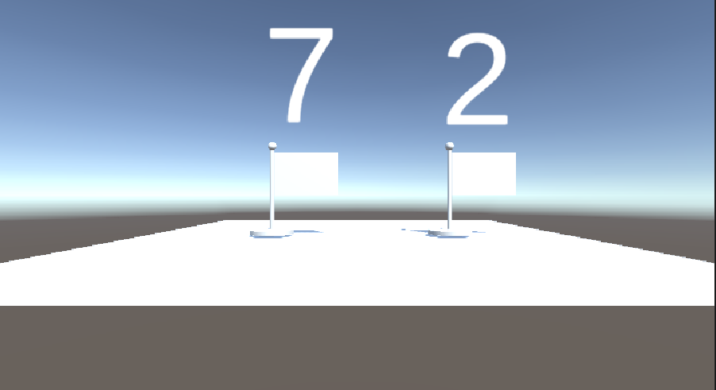

# RandomNumber_Unity

# Japanese
## 概要
Unity上でランダムな数値を表示するシンプルなサンプルプロジェクトです。起動時に数値を生成し、TextMeshPro に出力します。`.unitypackage` を Unity プロジェクトに取り込むことで、そのまま展開して利用できます。

### Image


## 使用技術
- 言語: C#
- ライブラリ/フレームワーク: Unity, TextMeshPro
- データベース: なし
- その他: .unitypackage

## クイックスタート
### 前提条件
- Unity Editor が利用できること
- TextMeshPro が利用可能であること

### インストール方法
```bash
git clone https://github.com/rainbow0210/RandomNumber_Unity.git
cd RandomNumber_Unity
```

`RandomNumber.unitypackage` を Unity エディタにインポートするか、プロジェクトに展開してください。展開後にシーンへスクリプトと表示用オブジェクトを配置して使用します。

### 基本的な使い方
1. Unity でプロジェクトを開きます。
2. `RandomNumber.unitypackage` をインポートします。
3. `RandomNumber` スクリプトを対象の GameObject にアタッチします。
4. Inspector で `text_number` に表示先の `TextMeshPro` を設定します。
5. シーンを再生すると、起動時にランダムな数値が表示されます。

## 主な機能
- 起動時にランダムな数値を生成します。
- 生成した数値を TextMeshPro に表示します。
- サンプルとして Unity の基本的なスクリプト連携を確認できます。

## 設定
`RandomNumber.cs` の `text_number` 配列に表示先の `TextMeshPro` オブジェクトを割り当ててください。表示桁数や生成範囲を変えたい場合は、`Random.Range(0, 9)` の値を調整します。

## APIリファレンス / ドキュメント
- スクリプト本体: [RandomNumber.cs](RandomNumber.cs)
- 画面イメージ: [images/ScrennShot.png](images/ScrennShot.png)
- Unity 公式ドキュメント: https://docs.unity3d.com/
- TextMeshPro 公式ドキュメント: https://docs.unity3d.com/Packages/com.unity.textmeshpro@latest

## ライセンス
Unlicense license

# English
## Overview
This is a simple sample project that displays random numbers in Unity. It generates values on startup and outputs them through TextMeshPro. You can import the `.unitypackage` into a Unity project and expand it for immediate use.

### Image


## Technologies Used
- Language: C#
- Library/Framework: Unity, TextMeshPro
- Database: None
- Other: `.unitypackage`

## Quick Start
### Prerequisites
- Unity Editor must be available
- TextMeshPro must be available

### Installation
```bash
git clone https://github.com/rainbow0210/RandomNumber_Unity.git
cd RandomNumber_Unity
```

Import `RandomNumber.unitypackage` into the Unity Editor, or expand it into your project. After that, place the script and display objects into a scene and use them there.

### Basic Usage
1. Open the project in Unity.
2. Import `RandomNumber.unitypackage`.
3. Attach the `RandomNumber` script to the target GameObject.
4. Assign the output `TextMeshPro` objects to the `text_number` field in the Inspector.
5. Run the scene to display random numbers at startup.

## Main Features
- Generates random numbers on startup.
- Displays the generated values in TextMeshPro.
- Works as a simple Unity scripting example.

## Configuration
Assign the target `TextMeshPro` objects to the `text_number` array in `RandomNumber.cs`. If you want to change the number of digits or the generation range, adjust the value passed to `Random.Range(0, 9)`.

## API Reference / Documentation
- Script: [RandomNumber.cs](RandomNumber.cs)
- Screenshot: [images/ScrennShot.png](images/ScrennShot.png)
- Unity Documentation: https://docs.unity3d.com/
- TextMeshPro Documentation: https://docs.unity3d.com/Packages/com.unity.textmeshpro@latest

## License
Unlicense license
